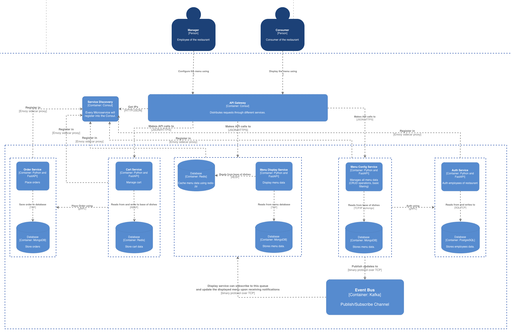

https://github.com/opielapatryk/restaurant-management-system/assets/104018084/dbb944c0-71a2-469e-9c6f-ecbfbd6f7ebb

# Restaurant Management System
To run project you need running kubernetes i.e. on Docker Desktop. 
Instruction for installation is located in kubernetes/readme.md 

## Goals and scope of project:
This system will be created using microservices,  
right now there will be only five of them: 
- Display Menu Service 
- Config Menu Service 
- Auth Service 
- Cart Service 
- Order Service 
In the future I will fill up the project with other functionalities :) 

## Used technology and tools
API Gateway: Consul 
Service Discovery: Consul 
Communication between client and microservices: REST API 
Sync communication between microservices: gRPC 
Async communication between microservices: RabbitMQ 
Cache: Redis 
Database Menu: MongoDB 
Database Employees: PostgreSQL 
Microservices: Fast API 
